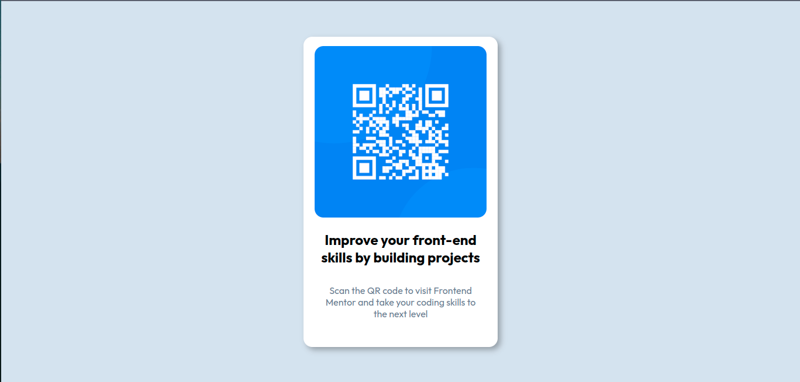

# Frontend Mentor - QR code component solution

This is a solution to the [QR code component challenge on Frontend Mentor](https://www.frontendmentor.io/challenges/qr-code-component-iux_sIO_H). Frontend Mentor challenges help you improve your coding skills by building realistic projects. 

## Table of contents

- [Overview](#overview)
  - [Screenshot](#screenshot)
  - [Links](#links)
- [My process](#my-process)
  - [Built with](#built-with)
  - [What I learned](#what-i-learned)
  - [Continued development](#continued-development)
  - [Useful resources](#useful-resources)
- [Author](#author)
- [Acknowledgments](#acknowledgments)

**Note: Delete this note and update the table of contents based on what sections you keep.**

## Overview

### Screenshot

### Links

- Solution URL: [Add solution URL here](https://your-solution-url.com)
- Live Site URL: [Add live site URL here](https://your-live-site-url.com)

### Built with

- Semantic HTML5 markup
- CSS custom properties
- CSS Grid
- Mobile-first workflow
- [Google Fonts](https://fonts.googleapis.com/css2?family=Outfit:wght@100..900&display=swap)

### What I learned

I learned or recapped a little about grid, its simple but perfect approach to this type of projects, I learned a little about the difference between rem and em

### Continued development

I want to continue focusing on UI design and learn UX, improve my understanding of interfaces and my CSS, HTML skills... reach a high level with it

## Author

- Frontend Mentor - [@josealzate97](https://www.frontendmentor.io/profile/josealzate97)

## Acknowledgments

N/A

